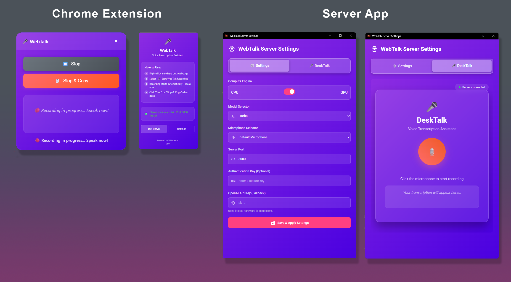

# WebTalk - Voice Transcription Tool

WebTalk is a powerful voice transcription tool that combines local Whisper AI with a Chrome extension for seamless speech-to-text conversion on any webpage.

## ✨ Beautiful Desktop Interface



*WebTalk features a sleek, modern settings interface that makes configuring your voice transcription setup effortless.*

## 🌟 Features

- 🎤 **Local AI Transcription** - Uses OpenAI Whisper running locally on your machine
- 🌐 **Chrome Extension** - Right-click context menu for instant voice recording on any webpage  
- ⚙️ **Beautiful Settings App** - Modern GUI for configuring models, GPU/CPU, and settings
- 🚀 **One-Click Launch** - Single launcher starts everything you need
- 🔒 **Privacy Focused** - All processing happens locally, no data sent to external servers
- ⚡ **GPU Acceleration** - Optional CUDA support for faster transcription
- 🎛️ **Multiple Models** - Choose from tiny to large Whisper models based on your needs

## 🚀 Quick Start

### 1. Installation
```bash
# Clone the repository
git clone https://github.com/psdwizzard/WebTalk.git
cd WebTalk

# Run the installer (takes a few minutes)
install.bat
```

**System Requirements:**
- Windows 10/11
- Python 3.8+ (not Microsoft Store version)
- Visual C++ Redistributable
- WebView2 Runtime
- 4GB+ RAM (8GB+ recommended for larger models)

### 2. Launch WebTalk
```bash
# Start everything with one command (use .\\ in PowerShell)
.\Launch.bat
```

This single command starts:
- 🤖 The Whisper transcription server (localhost:8000)  
- 🖥️ The beautiful settings desktop app (localhost:5555)
- 🔗 Everything needed for the Chrome extension to connect

### 3. Install Chrome Extension
1. Open Chrome and go to `chrome://extensions/`
2. Enable "Developer mode" (toggle in top right)
3. Click "Load unpacked" and select the `chrome_extension` folder
4. The WebTalk extension will appear in your toolbar

### 4. Start Transcribing!
- Right-click on any webpage
- Select "Start Recording" from the context menu
- Speak into your microphone
- Watch your speech appear as text!

## 📁 Project Structure

```
WebTalk/
├── README.md                     # This file
├── requirements.txt              # Python dependencies  
├── install.bat                   # Setup script
├── Launch.bat                    # 🚀 MAIN LAUNCHER
├── server.py                     # 🤖 Whisper transcription server
├── settings_app_flask.py        # 🖥️ Settings GUI application
├── webtalk_settings.py          # Entry point helper
├── webtalk_config.json          # Configuration file
├── WebTalk.ico         # App icon
├── chrome_extension/            # Browser extension
├── docs/                        # Documentation & screenshots
├── build/                       # Executable building tools
└── whisper_env/                 # Python virtual environment
```

## ⚙️ Configuration

The settings app provides an intuitive interface to configure:

- **🤖 AI Model**: Choose between different Whisper models (base, small, medium, large, turbo)
- **💻 Compute Engine**: Select GPU (CUDA) or CPU processing
- **🌐 Server Port**: Configure the port for the transcription server
- **🎤 Microphone**: Select your preferred audio input device
- **🔐 Authentication**: Optional security features
- **☁️ OpenAI Fallback**: API key for cloud processing when needed

Configuration is automatically saved to `webtalk_config.json` and applied in real-time.

## 🔧 Requirements

- **OS**: Windows 10/11
- **Python**: 3.8+ (automatically installed via `install.bat`)
- **Browser**: Chrome/Chromium
- **GPU**: CUDA-compatible GPU (optional, for faster processing)
- **Storage**: ~2-4GB for models and dependencies

## 💡 Tips

- **First Run**: The first transcription may take longer as models are downloaded
- **GPU vs CPU**: GPU processing is 5-10x faster but requires CUDA setup
- **Model Selection**: Start with "base" model for good balance of speed/accuracy
- **Microphone**: Ensure Chrome has microphone permissions enabled

## 📝 License

This project is licensed under the MIT License - see the LICENSE file for details.

## 🤝 Contributing

Contributions are welcome! Please feel free to submit a Pull Request.

## 🔧 Troubleshooting

### Installation Issues

**"Python is not installed or not in PATH"**
- Install Python from [python.org](https://python.org)
- ⚠️ **IMPORTANT**: Check "Add Python to PATH" during installation
- ⚠️ **AVOID**: Microsoft Store Python (use python.org version)

**"Failed to create virtual environment"**
- Make sure you have the full Python installation (not Microsoft Store version)
- Try running Command Prompt as Administrator
- Update Python to the latest version

**PyWebView Installation Fails**
- Install Visual C++ Redistributable: [Download here](https://aka.ms/vs/17/release/vc_redist.x64.exe)
- Install WebView2 Runtime: [Download here](https://developer.microsoft.com/en-us/microsoft-edge/webview2/)
- Restart your computer after installing these

**PyTorch CUDA Installation Fails**
- This is normal if you don't have an NVIDIA GPU
- The installer will automatically fall back to CPU version
- CPU version works fine, just slower for large audio files

### Runtime Issues

**Settings App Won't Open**
- Install WebView2 Runtime: [Download here](https://developer.microsoft.com/en-us/microsoft-edge/webview2/)
- Check Windows Defender isn't blocking the application
- Try running `Launch.bat` as Administrator

**Chrome Extension Can't Connect**
- Make sure both server and settings app are running (`Launch.bat`)
- Check that Windows Firewall isn't blocking localhost connections
- Try disabling other extensions that might interfere
- Restart Chrome after installing the extension

**"No module named 'torch'" Error**
- Activate the virtual environment: `whisper_env\Scripts\activate.bat`
- Reinstall dependencies: `pip install -r requirements.txt`
- Try running the installer again

**Microphone Not Working**
- Check microphone permissions in Windows Settings
- Ensure microphone is working in other applications
- Try a different microphone or USB headset

**Slow Transcription**
- Use a smaller Whisper model in settings (tiny, base instead of large)
- Consider upgrading RAM (8GB+ recommended)
- For faster processing, use a computer with NVIDIA GPU

### Performance Tips

**For Better Speed:**
- Use GPU if available (NVIDIA graphics card)
- Use smaller models (tiny, base) for faster transcription
- Close other applications to free up RAM
- Use shorter audio clips

**For Better Accuracy:**
- Use larger models (medium, large) for better quality
- Ensure good microphone quality
- Record in quiet environment
- Speak clearly and at moderate pace

---

**Made with ❤️ for seamless voice transcription** 