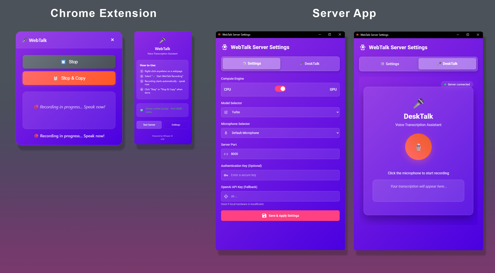

# WebTalk - Voice Transcription Tool

WebTalk is a powerful voice transcription tool that combines local Whisper AI with a Chrome extension for seamless speech-to-text conversion on any webpage.

## ✨ Beautiful Desktop Interface



*WebTalk features a sleek, modern settings interface that makes configuring your voice transcription setup effortless.*

## 🌟 Features

- 🎤 **Local AI Transcription** - Uses OpenAI Whisper running locally on your machine
- 🌐 **Chrome Extension** - Right-click context menu for instant voice recording on any webpage  
- ⚙️ **Beautiful Settings App** - Modern GUI for configuring models, GPU/CPU, and settings
- 🚀 **One-Click Launch** - Single launcher starts everything you need
- 🔒 **Privacy Focused** - All processing happens locally, no data sent to external servers
- ⚡ **GPU Acceleration** - Optional CUDA support for faster transcription
- 🎛️ **Multiple Models** - Choose from tiny to large Whisper models based on your needs

## 🚀 Quick Start

### 1. Installation
```bash
# Clone the repository
git clone https://github.com/psdwizzard/WebTalk.git
cd WebTalk

# Run the installer (takes a few minutes)
install.bat
```

### 2. Launch WebTalk
```bash
# Start everything with one command (use .\ in PowerShell)
.\Launch.bat
```

This single command starts:
- 🖥️ The beautiful settings desktop app (localhost:5555)
- 🤖 The Whisper transcription server (localhost:8000)  
- 🔗 Everything needed for the Chrome extension to connect

### 3. Install Chrome Extension
1. Open Chrome and go to `chrome://extensions/`
2. Enable "Developer mode" (toggle in top right)
3. Click "Load unpacked" and select the `chrome_extension` folder
4. 🎉 The WebTalk extension icon should appear in your toolbar

### 4. Start Transcribing
1. Right-click on any webpage
2. Select "🎤 Start WebTalk Recording"
3. Speak into your microphone
4. ✨ Get instant transcription inserted into text fields

## 📁 Project Structure

```
WebTalk/
├── README.md                     # This file
├── requirements.txt              # Python dependencies  
├── install.bat                   # Setup script
├── Launch.bat                    # 🚀 MAIN LAUNCHER
├── settings_app_flask.py        # 💎 Core unified application (server + GUI)
├── webtalk_settings.py          # Entry point helper
├── webtalk_config.json          # Configuration file
├── ComfyUI_00803__C.ico         # App icon
├── chrome_extension/            # Browser extension
├── docs/                        # Documentation & screenshots
├── build/                       # Executable building tools
└── whisper_env/                 # Python virtual environment
```

## ⚙️ Configuration

The settings app provides an intuitive interface to configure:

- **🤖 AI Model**: Choose between different Whisper models (base, small, medium, large, turbo)
- **💻 Compute Engine**: Select GPU (CUDA) or CPU processing
- **🌐 Server Port**: Configure the port for the transcription server
- **🎤 Microphone**: Select your preferred audio input device
- **🔐 Authentication**: Optional security features
- **☁️ OpenAI Fallback**: API key for cloud processing when needed

Configuration is automatically saved to `webtalk_config.json` and applied in real-time.

## 🔧 Requirements

- **OS**: Windows 10/11
- **Python**: 3.8+ (automatically installed via `install.bat`)
- **Browser**: Chrome/Chromium
- **GPU**: CUDA-compatible GPU (optional, for faster processing)
- **Storage**: ~2-4GB for models and dependencies

## 💡 Tips

- **First Run**: The first transcription may take longer as models are downloaded
- **GPU vs CPU**: GPU processing is 5-10x faster but requires CUDA setup
- **Model Selection**: Start with "base" model for good balance of speed/accuracy
- **Microphone**: Ensure Chrome has microphone permissions enabled

## 📝 License

This project is licensed under the MIT License - see the LICENSE file for details.

## 🤝 Contributing

Contributions are welcome! Please feel free to submit a Pull Request.

---

**Made with ❤️ for seamless voice transcription** 